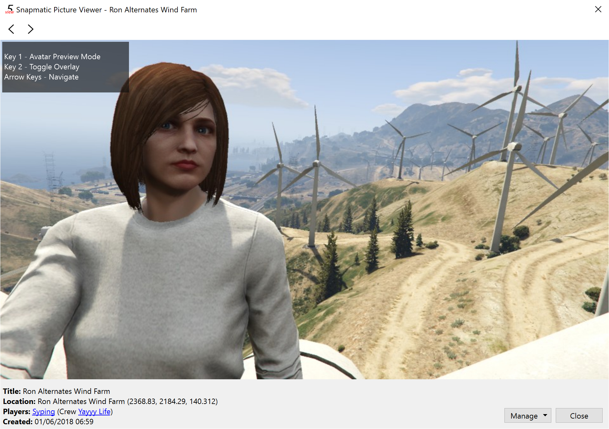
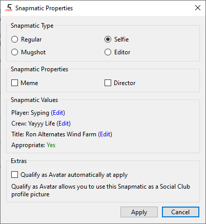

## gta5view
Open Source Snapmatic and Savegame viewer/editor for GTA V

- View Snapmatics with the ability to disable them in-game
- Edit Snapmatic pictures and properties in multiple ways
- Import/Export Snapmatics, Savegames and pictures
- Choose between multiple Social Club accounts as GTA V profiles IDs

#### Screenshots
  
  

#### Build gta5view for Windows

    # Note: Install Docker Community Edition and Git before continuing
    git clone https://gitlab.com/Syping/gta5view && cd gta5view
    docker pull sypingauto/gta5view-build:1.10-static
    docker run --rm -v ${PWD}:/gta5view -it sypingauto/gta5view-build:1.10-static
    cd /gta5view && mkdir -p build && cd build
    mingw64-qt-cmake ../
    make -j $(nproc --all)

#### Build gta5view for Debian/Ubuntu

    sudo apt-get install cmake git gcc g++ libqt5svg5-dev make qtbase5-dev qttranslations5-l10n
    git clone https://gitlab.com/Syping/gta5view && cd gta5view
    mkdir -p build && cd build
    cmake ../
    make -j $(nproc --all)
    sudo make install

#### Build gta5view for Arch/Manjaro

    sudo pacman -S cmake gcc git make qt5-base qt5-svg qt5-tools qt5-translations
    git clone https://gitlab.com/Syping/gta5view && cd gta5view
    mkdir -p build && cd build
    cmake ../
    make -j $(nproc --all)
    sudo make install

#### Build gta5view for Fedora

    sudo dnf install cmake git gcc gcc-c++ make qt5-qtbase-devel qt5-qtsvg-devel qt5-qttranslations
    git clone https://gitlab.com/Syping/gta5view && cd gta5view
    mkdir -p build && cd build
    cmake ../
    make -j $(nproc --all)
    sudo make install
